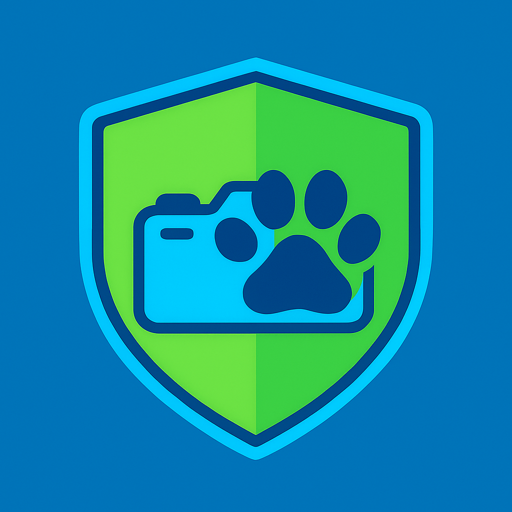

# 🦉 Smart Wildlife & Intruder Detection System

> **Unified IoT Project — Sustainability Blocked Week**  
> **UN Goals:** 15 – Life on Land · 11 – Sustainable Cities · 16 – Peace, Justice and Strong Institutions  

A smart IoT platform designed to monitor outdoor environments, detect motion, classify detected entities using machine learning, and contribute to both **biodiversity monitoring** and **security awareness**.  

---

## 🌍 Overview

Our project combines **IoT**, **AI**, and **web technologies** to create a system that can distinguish between **wildlife activity** (e.g., cats, dogs, birds) and **human intrusions**.  
It uses motion sensors and a camera to automatically capture and analyze events, displaying the results in an interactive **web dashboard**.

The platform aims to help local communities and researchers:
- Monitor **biodiversity** and animal presence patterns.
- Enhance **urban and rural safety** with non-invasive surveillance.
- Promote **coexistence** between nature and urban development.

---

## 🧩 Key Features

- 🎯 **Motion detection** using PIR sensors and a camera.  
- 📸 **Automatic image capture** on detection.  
- 🧠 **Machine learning classification** (TensorFlow Lite):  
  - *cat / dog / bird / human / unknown*  
- ☁️ **Cloud data storage** (MongoDB) with metadata:  
  - timestamp, temperature, humidity, and classification results.  
- 🗺️ **Interactive dashboard** with filters, graphs, and image gallery.  
- 🐾 **Species tagging**: manually label and enrich wildlife data.  
- 📬 **Notifications** (email or web alerts) for potential intrusions.  
- 🔒 **Privacy-aware design** — focused on sustainability, not surveillance.

---

## ⚙️ Technologies Used

| Layer | Tools & Frameworks |
|-------|--------------------|
| **Hardware** | Raspberry Pi / ESP32, PIR sensor, camera |
| **Backend** | Node.js, Express, MQTT (optional) |
| **Database** | MongoDB (+ InfluxDB for time-series data) |
| **Frontend** | React |
| **ML / AI** | TensorFlow Lite (cat/dog/bird/human model) |

## 🌐 Sustainability Goals Alignment

| UN Goal | Description | Project Impact |
|----------|--------------|----------------|
| **15 – Life on Land** | Protect, restore, and promote sustainable ecosystems | Tracks wildlife activity and supports biodiversity studies |
| **11 – Sustainable Cities** | Make cities inclusive, safe, and resilient | Provides non-invasive security monitoring |
| **16 – Peace, Justice, and Strong Institutions** | Promote peaceful and inclusive societies | Encourages ethical technology use for safety |

